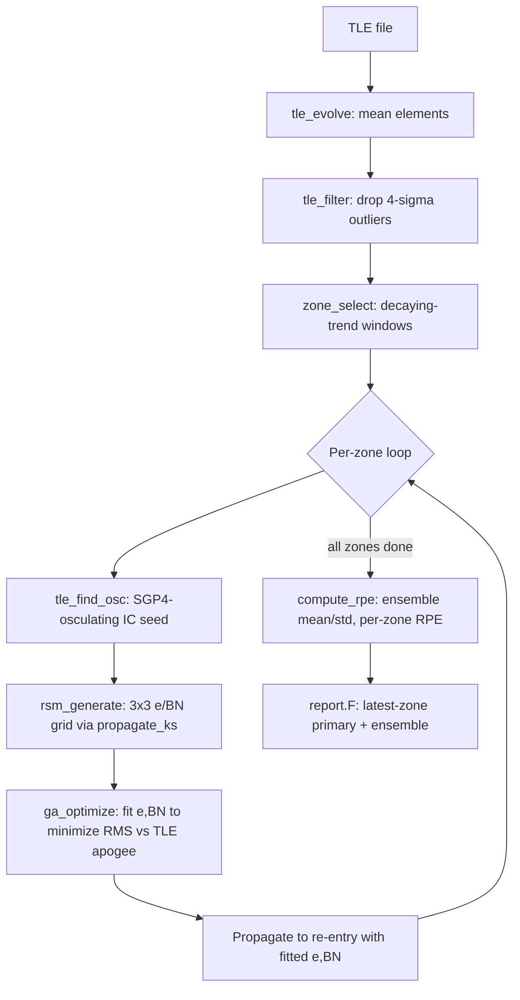

# ALGORITHM.md — OREM

## 1. Overview
OREM (Optimal Regularized re-Entry Method) predicts atmospheric re-entry
dates for GTO/HEO rocket bodies and debris from their real TLE (Two-Line
Element) tracking history. It embeds `KSROP`'s own KS-regularized propagator
source directly (`ksrop\propagate_ks.F`, `Subrouts.F`, `TLEread.F`,
`Legendre.F`) and builds a full pipeline on top: TLE ingestion → data-quality
filtering → zone (decay-trend-window) selection → per-zone response-surface
+ genetic-algorithm fitting of ballistic number and eccentricity → re-entry
propagation → an ensemble prediction across zones with an RPE (Relative
Prediction Error) accuracy metric. It is the most actively developed repo
under `GitHub\` and the direct consumer of `KSROP`'s propagator; the
operational layer around it (Space-Track data ops, scheduling, a watchlist
database) is a separate repo, `OREM-Watchlist`.

## 2. Problem Statement
Given an object's real TLE tracking history (which encodes its orbit's
gradual decay under atmospheric drag, but not its physical ballistic
coefficient directly), estimate the ballistic number `BN = m/(Cd·A)` and
eccentricity that best explain the observed decay trend, then propagate
forward under the full force model to predict when perigee altitude drops
below 80 km (re-entry). "Correct" means the predicted re-entry date is close
to the object's actual catalogued decay date — quantified by RPE = (predicted
− actual) / (actual − fit-window-epoch) × 100%. The central difficulty is
that BN is not directly observable from TLE data; it must be inferred
indirectly by matching a propagated apogee-altitude trajectory (function of
BN and e) against the TLE's own apogee-altitude history.

## 3. Inputs
- A TLE history file (one NORAD ID, chronological entries) — real Space-Track
  data, `input/example_<norad>.tle.txt`.
- The target NORAD catalog ID and (optionally, for retrospective validation)
  the actual observed decay date `t_obs_cal`.
- Zone-selection parameters: `nzones_max`, `min_zone_pts` (default 8),
  `max_zone_days` (default 10), `r2_thresh`/`slope_thresh` (decay-trend
  linearity thresholds).
- BN search bounds `bn_min_init`/`bn_max_init` (default [80,160] kg/m²) and
  `idrag_flag` (drag on/off — off is used for diagnostic/test runs only).
- GA parameters (`ipopsize`, `maxgen`, `nbits_e`, `nbits_a`, `pcross`,
  `pmute`, `ga_seed`).
- Force-model degree (`ngeo_deg`, `nsun_deg`, `nmoon_deg`) and the full set
  of drag/SRP/rotation parameters `propagate_ks` itself needs (see
  `KSROP\ALGORITHM.md` §3 — identical interface, since this *is* KSROP's
  propagator).
- `ATM.DAT` (atmosphere table) and, for issue #26's epoch-resolved space
  weather, `input/SW-All.csv` (daily F10.7/Kp history).

## 4. Core Algorithm
`orem_run` (`orem.F`), the main entry point:

1. **TLE evolution** (`tle_evolve`, `tle_evolution.F`): parse the TLE file,
   extract mean elements per entry (semi-major axis from mean motion,
   eccentricity, inclination, RAAN, AOP, mean apogee/perigee altitude, Sun
   azimuth), build parallel time-series arrays.
2. **Quality filtering** (`tle_filter`, issue #10): drop points more than
   4σ off a local windowed trend in apogee altitude or eccentricity (20-TLE
   window, 30-day max gap) — tuned against 3 real objects at a ~1.5%
   false-positive rate.
3. **Zone selection** (`zone_select`): scan the filtered apogee-altitude time
   series for windows with a statistically significant negative (decaying)
   linear trend — R² ≥ `r2_thresh`, slope steeper than `slope_thresh`, at
   least `min_zone_pts` points, spanning at most `max_zone_days`. Returns up
   to `nzones_max` candidate zones, sorted so later (more recent, closer to
   actual decay) zones are preferred when the cap is reached.
4. **G2 BN floor** (issue #12): before the per-zone loop, `estimate_bn_floor`
   runs one calibration trial propagation from zone 1's own observed
   decay rate and extends `bn_lo` downward (never upward, never touches
   `bn_hi`) if the caller's `bn_min_init` would otherwise exclude the
   physically-implied BN.
5. **Per-zone loop** (`iz = 1..nzones`), for each zone:
   a. Extract that zone's TLE points; overwrite the apogee series
      (`haz`) with true SGP4-osculating values via `tle_find_osc`
      (issue #31 fix — `propagate_ks`'s surfaces are osculating, so the
      fitness comparison must be too, not raw TLE mean elements).
   b. Seed the zone's propagation initial condition (index 1 of the zone
      arrays) from a fresh SGP4-osculating state at the zone's own first
      TLE point (`tle_find_osc` again). **A zone-to-zone trajectory-
      continuity alternative to this — propagating the previous zone's own
      fitted state forward instead of re-anchoring to fresh TLE data — was
      tried and reverted** (measurably regressed RPE on both the 7- and
      30-object campaigns; see issue #33 and README v1.28). Every zone
      independently re-anchors to real data.
   c. **RSM** (`rsm_generate`, `rsm.F`): build a 3×3 grid over
      (eccentricity, BN), propagate each of the 9 combinations via
      `propagate_ks` from the zone's IC, and interpolate each resulting
      apogee-altitude trajectory onto the zone's own TLE observation
      epochs — producing `surfaces(nobs,3,3)`.
   d. **GA fit** (`ga_optimize`, `ga.F`): a binary-encoded genetic
      algorithm searches the (e, BN) space (bilinearly interpolated within
      the RSM grid) to minimize RMS(predicted apogee − observed apogee)
      over the zone's TLE points — this is the actual model-fitting step.
   e. Boundary-saturation diagnostic (issue #12): if the GA optimum lands
      within 15% of either search bound, flag `zone_status=2` (true value
      may lie outside the searched range) — purely diagnostic, does not
      alter the fit.
   f. **Re-entry propagation**: propagate from the zone's IC using the
      fitted (e, BN) for up to 5 years (or until altitude < 80 km),
      recording the re-entry date if reached within that horizon.
   g. **BN search range**: stays fixed at `[bn_min_init, bn_max_init]` (plus
      the one-time G2 floor adjustment) for every zone — a v1.21
      trust-gated per-zone narrow/widen scheme existed here previously and
      was removed 2026-07-23 (also part of issue #33; kept, unlike the IC
      chaining, despite also measuring as a small regression, per explicit
      user direction to isolate which piece was responsible for what).
6. **Ensemble + RPE** (`compute_rpe`): mean and standard deviation of all
   zones' predicted re-entry dates form the ensemble estimate; RPE is
   computed either against a known observed decay date (validation mode) or
   against the ensemble mean itself (operational mode, no ground truth
   available). The **latest zone's own prediction**, not the ensemble mean,
   is reported as the primary estimate (later zones use more recent, more
   representative TLE data).

## 5. Key Equations / Physics
The propagation physics is identical to `KSROP` (see `KSROP\ALGORITHM.md`
§5) — OREM adds no new force-model terms, only the fitting/selection layer
around it:
- **Zone linearity test**: standard linear-regression R² and slope on
  apogee altitude vs. time within a candidate window.
- **RSM interpolation**: bilinear in (e, BN) over the 3×3 grid, linear in
  time between adjacent trajectory dump points (`rsm_tinterp`).
- **GA fitness**: RMS(`propagate_ks`-predicted apogee − TLE-observed
  apogee) over all points in a zone — the single objective every fit
  minimizes.
- **RPE**: `(predicted − actual) / (actual − zone_epoch) × 100`, i.e.
  prediction error normalized by the horizon length being extrapolated
  over (so a 10-day error on a 10-day-out prediction is scored the same as
  a 100-day error on a 100-day-out prediction).

## 6. Outputs
- Per-zone: `e_opt`, `bn_opt`, `rms_out` (GA fit quality), `reentry_jd`
  (predicted re-entry Julian date, 0 if none within horizon), `rpe_out`,
  `zone_status` (0=ok, 1=propagator failure, 2=boundary-saturated,
  3=envelope-doesn't-bound-observations, 4=too-few-points).
- Ensemble: `t_mean`, `t_std` across zones with a valid prediction.
- Formatted prediction report (`report.F`, issue #13):
  `output/OREM_<norad>_<date>.txt` — zone table, primary (latest-zone)
  estimate, ensemble summary.
- `ierr`: 0=ok, 1=TLE error, 2=no zones found, 3=all zones failed.

## 7. Complexity & Performance
Dominant cost is `propagate_ks` calls: 9 per zone for the RSM grid (each a
full KS-regularized propagation of the zone's span) plus 1 per zone for the
final re-entry propagation (up to 5 years), times `nzones` (up to 8 by
default, up to 50 in `OREM-Watchlist`'s operational config). The GA fit
itself (`ipopsize`×`maxgen` fitness evaluations) is cheap — it interpolates
the already-computed RSM surfaces rather than re-propagating. **The 4-core
cap (`GitHub\CLAUDE.md` §1) applies but is not currently enforced by
parallelizing anything** — every `propagate_ks` call in the pipeline runs
sequentially; the 9 RSM grid points *could* be parallelized (they're
independent) but aren't in the current implementation.

## 8. Validation & Accuracy
345 tests pass across 6 test executables (`test_orem`, `test_reentry`,
`test_e2e`, plus the KSROP-inherited `test_propagate_ks`/
`test_tle_evolution`/`test_zone_select`/`test_rsm`/`test_ga`/`test_gmat`) as
of this session. Real-object campaigns: the curated 7-object validation set
currently runs at **14.2% mean latest-zone \|RPE\|** (post-issue-#31 fix,
which corrected a mean-vs-osculating fitness basis mismatch present since
the pipeline's inception but made per-zone fits noisier in the process — a
deliberate, documented trade-off, see README v1.27); a broader 30-object
campaign (mixing well-tracked and sparsely-tracked objects) runs
substantially worse (~23-33% depending on which of two recently-tried,
both-regressed BN-search variants is active — see issue #33), reflecting
that the curated set is not representative of the full population OREM is
meant to handle. Cross-validated against GMAT at the propagator level (see
`KSROP\ALGORITHM.md` §8) — OREM's own fitting/selection layer has no
independent-tool cross-validation of its own, only real-decay-date
comparison.

## 9. Known Limitations
- **RPE plateaus well above what the propagator's own GMAT-validated
  accuracy would suggest is achievable** — the subject of an active,
  ongoing global investigation (issue #32) into whether the remaining error
  is TLE noise, density-model error, ballistic-coefficient/attitude
  variability, algorithmic identifiability, or (per literature findings
  from that investigation) a genuine physical limit for objects in or near
  solar apsidal resonance, where the field's own literature states
  deterministic prediction may be provably infeasible.
- **No diurnal atmospheric density bulge** — inherited directly from
  `KSROP` (see that repo's ALGORITHM.md §9); a specified fix from the
  literature exists but isn't implemented.
- **Issue #27** (33587): a critical-inclination lunisolar perigee-collapse
  case not yet resolved by any generic hypothesis tested so far — narrowed
  during the literature investigation to a solar-apsidal-resonance
  mechanism, not yet implemented as a diagnostic.
- **Issue #29**: the shipped `nzones_max=8` default doesn't generalize to
  the broader object population (`OREM-Watchlist` operationally overrides
  it to 50).
- Zone-to-zone BN estimates are fit completely independently (per §4.5.b);
  literature (see project memory) suggests ballistic coefficient/attitude
  do vary systematically zone-to-zone, but the one concrete attempt to
  exploit that (trajectory-continuity IC chaining) measurably hurt
  accuracy rather than helping — the right way to use that literature
  finding, if any, is still unresolved.
- Only degree-2190 EGM2008 zonals, drag, luni-solar third-body, and SRP are
  modeled — same force-model scope as KSROP, no additions specific to
  OREM's own re-entry-prediction use case.

## 10. Dependencies
- **`KSROP`** (embeds directly): `ksrop\propagate_ks.F`, `Subrouts.F`,
  `TLEread.F`, `Legendre.F` are copied source, not a package dependency —
  changes to KSROP's own repo are not automatically picked up here and
  would need to be manually re-synced.
- **Depended on by `OREM-Watchlist`**: which orchestrates `orem.exe` as a
  subprocess for operational Space-Track-driven monitoring, with its own
  operational config overrides (`nzones_max=50`, `max_zone_days=30`).
- No dependency on `KS-Pc`, `LOFT`, `KSRENT-PY`, `Opt-LunePr`, or `PERTBP`.
