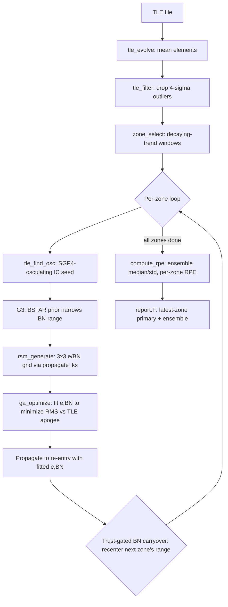

# ALGORITHM.md — OREM

## 1. Overview
OREM (Optimal Regularized re-Entry Method) predicts atmospheric re-entry
dates for GTO/HEO rocket bodies and debris from their real TLE (Two-Line
Element) tracking history. It's an `fpm` package that consumes `KSROP` as a
real git+tag dependency (§10) — `src/propagate_ks.F` carries KSROP's own
KS-regularized propagator physics, refactored into a callable subroutine —
and builds a full pipeline on top: TLE ingestion → data-quality
filtering → zone (decay-trend-window) selection → per-zone response-surface
+ genetic-algorithm fitting of ballistic number and eccentricity → re-entry
propagation → an ensemble prediction across zones with an RPE (Relative
Prediction Error) accuracy metric. It is the most actively developed repo
under `GitHub\` and the direct consumer of `KSROP`'s propagator; the
operational layer around it (Space-Track data ops, scheduling, a watchlist
database) is a separate repo, `OREM-Watchlist`.

The zones + response-surface + genetic-algorithm architecture itself isn't
novel to this codebase — it's a direct methodological descendant of a line
of R.K. Sharma (co-author, §9) papers on GTO upper-stage reentry prediction:
Sharma, Bandyopadhyay & Adimurthy (2006) first states the response-surface +
GA (ballistic coefficient, perigee) fitting cost function; Mutyalarao &
Sharma (2010, 2011) extend it to explicit apogee-decay "zones" and a ±10%
BC-bounds uncertainty technique (the direct ancestor of the ±10% diagnostic
tested, and found too narrow, against OREM's own uncertainty reporting —
issue #32). KS regularization with oblateness as the propagation framework
traces to Sharma & James Raj (1988), predating KSROP itself by decades. See
§9 for full citations.

## 2. Problem Statement
Given an object's real TLE tracking history (which encodes its orbit's
gradual decay under atmospheric drag, but not its physical ballistic
coefficient directly), estimate the ballistic number `BN = m/(Cd·A)` and
eccentricity that best explain the observed decay trend, then propagate
forward under the full force model to predict when perigee altitude drops
below 80 km (re-entry). "Correct" means the predicted re-entry date is close
to the object's actual catalogued decay date — quantified by RPE = (predicted
− actual) / (actual − fit-window-epoch) × 100%. The central difficulty is
that BN is not directly observable from TLE data; it must be inferred
indirectly by matching a propagated apogee-altitude trajectory (function of
BN and e) against the TLE's own apogee-altitude history.

## 3. Inputs
- A TLE history file (one NORAD ID, chronological entries) — real Space-Track
  data, `input/example_<norad>.tle.txt`.
- The target NORAD catalog ID and (optionally, for retrospective validation)
  the actual observed decay date `t_obs_cal`.
- Zone-selection parameters: `nzones_max`, `min_zone_pts` (default 8),
  `max_zone_days` (default 20, raised from 10 in v1.43 — issue #29, rescued
  7 of 12 previously-zero-valid-zone objects in the 50-object generalization
  set), `r2_thresh`/`slope_thresh` (decay-trend linearity thresholds).
- BN search bounds `bn_min_init`/`bn_max_init` (default [80,160] kg/m²) and
  `idrag_flag` (drag on/off — off is used for diagnostic/test runs only).
- GA parameters (`ipopsize`, `maxgen`, `nbits_e`, `nbits_a`, `pcross`,
  `pmute`, `ga_seed`).
- Force-model degree (`ngeo_deg`, `nsun_deg`, `nmoon_deg`) and the full set
  of drag/SRP/rotation parameters `propagate_ks` itself needs (see
  `KSROP\ALGORITHM.md` §3 — identical interface, since this *is* KSROP's
  propagator).
- `ATM.DAT` (atmosphere table) and, for issue #26's epoch-resolved space
  weather, `input/SW-All.csv` (daily F10.7/Kp history).

## 4. Core Algorithm
`orem_run` (`orem.F`), the main entry point:

1. **TLE evolution** (`tle_evolve`, `tle_evolution.F`): parse the TLE file,
   extract mean elements per entry (semi-major axis from mean motion,
   eccentricity, inclination, RAAN, AOP, mean apogee/perigee altitude, Sun
   azimuth), build parallel time-series arrays.
2. **Quality filtering** (`tle_filter`, issue #10): drop points more than
   4σ off a local windowed trend in apogee altitude or eccentricity (20-TLE
   window, 30-day max gap) — tuned against 3 real objects at a ~1.5%
   false-positive rate.
3. **Zone selection** (`zone_select`): scan the filtered apogee-altitude time
   series for windows with a statistically significant negative (decaying)
   linear trend — R² ≥ `r2_thresh`, slope steeper than `slope_thresh`, at
   least `min_zone_pts` points, spanning at most `max_zone_days`. Returns up
   to `nzones_max` candidate zones, sorted so later (more recent, closer to
   actual decay) zones are preferred when the cap is reached.
4. **G2 BN floor** (issue #12): before the per-zone loop, `estimate_bn_floor`
   runs one calibration trial propagation from zone 1's own observed
   decay rate and extends `bn_lo` downward (never upward, never touches
   `bn_hi`) if the caller's `bn_min_init` would otherwise exclude the
   physically-implied BN.
5. **Per-zone loop** (`iz = 1..nzones`), for each zone:
   a. Extract that zone's TLE points, using the smooth mean-element apogee
      trend directly as the fitness signal (`haz`), with no osculating
      bias correction applied to it. **A smooth (linear-in-time) bias
      correction toward osculating values was tried here (issue #31,
      revisited 2026-07-25) and REVERTED (issue #34, v1.46)**: an even
      earlier version had overwritten the apogee series per-point with an
      independent SGP4-osculating conversion of each TLE — correct in
      isolation, but each TLE's own true/mean-anomaly phase is effectively
      uncorrelated between points, so the resulting series carried phase
      noise that didn't match `propagate_ks`'s own smoothly-evolving
      trajectory and measured flat-to-worse. The 2026-07-25 fix instead fit
      only the *smooth* part of the mean/osculating bias via `linfit` and
      added it back onto the mean-element trend — a small net positive on
      the primary (latest-zone) metric at the time, kept despite a mild
      ensemble-metric regression. Re-tested under today's full stack
      (`max_zone_days=20`, the BN-carryover anchor fix, the median ensemble
      metric — none of which existed when it was first kept), it now
      regresses BOTH metrics instead: removing it improved curated-7
      mean\|latest-zone RPE\| 32.1%→25.9% and mean\|ensemble RPE\| 4.1%→
      1.9%. The original justification no longer held, so it was reverted
      outright rather than re-tuned.
   b. Seed the zone's propagation initial condition (index 1 of the zone
      arrays) from a fresh SGP4-osculating state at the zone's own first
      TLE point (`tle_find_osc`). **A zone-to-zone trajectory-continuity
      alternative to this — propagating the previous zone's own fitted
      state forward instead of re-anchoring to fresh TLE data — was tried
      and reverted** (measurably regressed RPE on both the 7- and 30-object
      campaigns; see issue #33 and README v1.28). Every zone independently
      re-anchors its own *initial condition* to real data — this is
      distinct from the BN *search range* carryover in (g) below, which
      does chain across zones.
   c. **RSM** (`rsm_generate`, `rsm.F`): build a 3×3 grid over
      (eccentricity, BN), propagate each of the 9 combinations via
      `propagate_ks` from the zone's IC, and interpolate each resulting
      apogee-altitude trajectory onto the zone's own TLE observation
      epochs — producing `surfaces(nobs,3,3)`.
   d. **GA fit** (`ga_optimize`, `ga.F`): a binary-encoded genetic
      algorithm searches the (e, BN) space (bilinearly interpolated within
      the RSM grid) to minimize RMS(predicted apogee − observed apogee)
      over the zone's TLE points — this is the actual model-fitting step.
   e. Boundary-saturation diagnostic (issue #12): if the GA optimum lands
      within 15% of either search bound, flag `zone_status=2` (true value
      may lie outside the searched range) — purely diagnostic, does not
      alter the fit.
   f. **Re-entry propagation**: propagate from the zone's IC using the
      fitted (e, BN) for up to 5 years (or until altitude < 80 km),
      recording the re-entry date if reached within that horizon.
   g. **BN search range**: two mechanisms narrow it, one stateless and one
      recursive. **G3** (issue #32, stateless): each zone's own
      TLE-published BSTAR value narrows the range via a pooled
      log10(BN)~log10(BSTAR) regression (intersection-only, falls back
      cleanly if BSTAR is unavailable). **Trust-gated carryover** (v1.21;
      a v1.21 narrow/widen scheme was removed as an isolated experiment in
      2026-07-23, then *restored* shortly after when removal alone
      measurably regressed accuracy — it is active today, not removed):
      if the previous zone actually predicted a re-entry (or is otherwise
      unflagged), re-center the *next* zone's range on that zone's own
      fitted BN (half-width if interior, widen ×1.5 around the window's
      existing center if the fit sat at a search boundary — v1.44 fixed a
      boundary-recentering bug that let repeated boundary hits escalate
      the window in one direction). **This recursive mechanism is a
      confirmed, recurring source of fragility**: four independent,
      individually-correct pipeline changes have each triggered a real
      accuracy regression through it (issue #35 has the full history). A
      non-recursive, pooled-median replacement was designed and tested but
      gave mixed results and was not shipped — the mechanism above is what
      runs today.
6. **Ensemble + RPE** (`compute_rpe`): the **median** (changed from a mean
   in v1.44, issue #29 — a mean lets one catastrophically-wrong zone, e.g.
   an early zone whose window is too far from the true re-entry to
   extrapolate linearly, drag the whole estimate off) and standard
   deviation of all zones' predicted re-entry dates form the ensemble
   estimate; RPE is computed either against a known observed decay date
   (validation mode) or against the ensemble median itself (operational
   mode, no ground truth available). The **latest zone's own prediction**,
   not the ensemble median, is still reported as the officially "PRIMARY"
   estimate (v1.20 — later zones use more recent, more representative TLE
   data) — though on the current curated-7 static campaign the ensemble
   median is *empirically more accurate* than the latest-zone estimate for
   all 7 objects, a real reversal from the relationship that originally
   motivated making latest-zone primary (see `ARCHITECTURE.md` §5.5/§6).

```mermaid
flowchart TD
    A[TLE file] --> B[tle_evolve: mean elements]
    B --> C[tle_filter: drop 4-sigma outliers]
    C --> D[zone_select: decaying-trend windows]
    D --> E{Per-zone loop}
    E --> F[tle_find_osc: SGP4-osculating IC seed]
    F --> G0[G3: BSTAR prior narrows BN range]
    G0 --> G[rsm_generate: 3x3 e/BN grid via propagate_ks]
    G --> H[ga_optimize: fit e,BN to minimize RMS vs TLE apogee]
    H --> I[Propagate to re-entry with fitted e,BN]
    I --> G1{Trust-gated BN carryover: recenter next zone's range}
    G1 --> E
    E -- all zones done --> J[compute_rpe: ensemble median/std, per-zone RPE]
    J --> K[report.F: latest-zone primary + ensemble]
```

## 5. Key Equations / Physics
The propagation physics is identical to `KSROP` (see `KSROP\ALGORITHM.md`
§5) — OREM adds no new force-model terms, only the fitting/selection layer
around it:
- **Zone linearity test**: standard linear-regression R² and slope on
  apogee altitude vs. time within a candidate window.
- **RSM interpolation**: bilinear in (e, BN) over the 3×3 grid, linear in
  time between adjacent trajectory dump points (`rsm_tinterp`).
- **GA fitness**: RMS(`propagate_ks`-predicted apogee − TLE-observed
  apogee) over all points in a zone — the single objective every fit
  minimizes.
- **RPE**: `(predicted − actual) / (actual − zone_epoch) × 100`, i.e.
  prediction error normalized by the horizon length being extrapolated
  over (so a 10-day error on a 10-day-out prediction is scored the same as
  a 100-day error on a 100-day-out prediction).

## 6. Outputs
- Per-zone: `e_opt`, `bn_opt`, `rms_out` (GA fit quality), `reentry_jd`
  (predicted re-entry Julian date, 0 if none within horizon), `rpe_out`,
  `zone_status` (0=ok, 1=propagator failure, 2=boundary-saturated,
  3=envelope-doesn't-bound-observations, 4=too-few-points).
- Ensemble: `t_mean` (median since v1.44, name kept for call-site
  compatibility), `t_std` across zones with a valid prediction.
- Formatted prediction report (`report.F`, issue #13):
  `output/OREM_<norad>_<date>.txt` — zone table, primary (latest-zone)
  estimate, ensemble summary, and (v1.47, issue #29) last-tracked-TLE
  perigee altitude as a decay-phase-proximity indicator — a raw number
  with reference medians inline, explicitly not a calibrated confidence
  score (`tle_last_perigee`, `orem.F`).
- `ierr`: 0=ok, 1=TLE error, 2=no zones found, 3=all zones failed.

## 7. Complexity & Performance
Dominant cost is `propagate_ks` calls: 9 per zone for the RSM grid (each a
full KS-regularized propagation of the zone's span) plus 1 per zone for the
final re-entry propagation (up to 5 years), times `nzones` (up to 8 by
default, up to 50 in `OREM-Watchlist`'s operational config). The GA fit
itself (`ipopsize`×`maxgen` fitness evaluations) is cheap — it interpolates
the already-computed RSM surfaces rather than re-propagating. **The 4-core
cap (`GitHub\CLAUDE.md` §1) applies but is not currently enforced by
parallelizing anything** — every `propagate_ks` call in the pipeline runs
sequentially; the 9 RSM grid points *could* be parallelized (they're
independent) but aren't in the current implementation.

## 8. Validation & Accuracy
385 tests pass across 12 test executables, built via `fpm test` (`test_orem`,
`test_reentry`, `test_e2e`, `test_sw`, plus the KSROP-lineage-inherited
`test_propagate_ks`/`test_tle_evolution`/`test_tle_filter`/`test_zone_select`/
`test_rsm`/`test_ga`/`test_ga_sensitivity`/`test_gmat`). Real-object
campaigns (all figures current, static atmosphere unless noted):
curated-7 mean\|latest-zone RPE\| **25.9%**, mean\|ensemble RPE\| **1.9%**
(median 1.2%) — the ensemble/median metric is currently *more* accurate
than the officially-primary latest-zone metric for all 7 of these objects
(see §4 step 6 above, and `ARCHITECTURE.md` §5.5/§6). With epoch-resolved weather + the
diurnal density bulge: mean\|latest\|=27.4%, mean\|ensemble\|=1.9%. Across
the 50-object generalization set: mean\|ensemble RPE\|=16.8%, predict rate
36/50 (72%). These numbers reflect real, ongoing generalization work
(issue #32's tracking umbrella) — not a single settled accuracy figure;
see README's Version History for the full sequence of individually-tested
changes that produced them. Cross-validated against GMAT at the propagator
level — OREM's own fitting/selection layer has no independent-tool
cross-validation of its own, only real-decay-date comparison.

## 9. Known Limitations
- **RPE plateaus well above what the propagator's own GMAT-validated
  accuracy would suggest is achievable** — the subject of an active,
  ongoing global investigation (issue #32) into whether the remaining error
  is TLE noise, density-model error, ballistic-coefficient/attitude
  variability, algorithmic identifiability, or a genuine physical limit for
  objects in or near solar apsidal resonance (35497, i=5.7°, is the
  project's persistent example — see `ARCHITECTURE.md` §6).
- **The trust-gated BN-range carryover across zones (§4 step 5g) is a
  confirmed, recurring source of fragility, not a resolved design.** Four
  independent, individually-correct pipeline changes have each triggered a
  real accuracy regression through this one recursive mechanism (issue
  #35 has the full history and root-cause trace); one of the four (the
  noise-matched-apobs fix, §4 step 5a) was resolved by reverting it
  outright (v1.46). A non-recursive replacement for the carryover
  mechanism itself was designed, implemented, and campaign-tested but gave
  genuinely mixed results (fixes one chronic per-object regression,
  regresses another) and was explicitly discarded, not shipped — the
  patch was deleted rather than kept for reapplication. A follow-on
  hypothesis — that the RSM/GA fit's own mean-vs-osculating basis
  inconsistency (§4 step 5c seeds an osculating IC into a fit whose
  targets stay mean-element) was itself feeding noise into the carryover
  chain — was also tested (reverting the osculating seed to pure mean
  elements) and also rejected: it regresses both curated-7 campaigns
  cleanly, so the osculating seed is doing real positive work despite the
  inconsistency (2026-07-28, issue #31 comment). **A sequential
  Bayesian/EnKF rewrite of the estimation architecture was identified as
  the only remaining structural alternative but has been explicitly
  deprioritized by project decision, not just left unstarted** — not
  currently a candidate to revisit. Any future pipeline change that could
  shift a zone's fitted BN even slightly should still be re-validated
  against the full campaign, not assumed safe from this interaction.
- **Issue #29**: the shipped `nzones_max=8` default's generalization gap to
  the broader 50-object population has been substantially, but not fully,
  closed (`max_zone_days` 10→20 raised the predict rate 58%→72%;
  `OREM-Watchlist` still operationally overrides `nzones_max` to 50 for
  its more variably-tracked real candidates). Of the objects that still
  don't predict, 5 have no clean decay signal anywhere in their tracked
  history at any window size tested — a genuine data-availability gap, not
  a tuning problem. **The remaining accuracy gap on the objects that DO
  predict is now understood, not just observed**: curated-7 mean\|ensemble
  RPE\|=1.9% vs. the other 43's 20.4% is largely explained by
  decay-phase-proximity composition — objects whose last tracked TLE
  already sits at a low perigee (predicting-object median 125 km) predict
  well; objects still at 300+ km (non-predicting median 333 km) correctly
  don't predict imminent re-entry, because they aren't near it (2026-07-28,
  `scratch_rpe/diag_issue29_decay_phase.py`). Not a uniform identifiability
  floor that gets worse with population size. Shipped as a reporting-only
  feature, v1.47: last-TLE perigee altitude now appears in every operational
  report as a proximity indicator (§6 above) — explicitly not a calibrated
  confidence score, since the two populations' distributions overlap
  substantially in the 150-340 km band.
- Three Falcon 9 R/B objects were removed from the 50-object generalization
  set (v1.45) since `propagate_ks` has no thrust/maneuver modeling at all
  and SpaceX is documented to perform active post-separation deorbit burns
  on Falcon 9 second stages — this whole fitting methodology's validity
  depends on drag+gravity+SRP being the complete force model, which does
  not hold for actively-maneuvered objects.
- Only degree-2190 EGM2008 zonals, drag (including the diurnal density
  bulge, v1.42), luni-solar third-body, and SRP are modeled — same
  force-model scope as KSROP, no thrust/maneuver modeling, no additions
  specific to OREM's own re-entry-prediction use case beyond the drag
  refinements already shipped.

## 10. Dependencies
- **`KSROP`**: OREM is an `fpm` (Fortran Package Manager) package that
  consumes KSROP as a real git+tag dependency declared in `fpm.toml` — not
  hand-copied files. `fpm build`/`fpm test` fetches the pinned KSROP tag
  into `build/dependencies/ksrop/` automatically; bumping the dependency
  means bumping the tag in `fpm.toml`, not re-syncing files by hand.
  `src/propagate_ks.F` itself is OREM's own file (refactored from KSROP's
  `driver_KS.F` into a callable subroutine, no file I/O) and carries fixes
  in both directions by hand where the physics is shared (e.g. the v1.18
  drag-phase fix and the v1.42 diurnal bulge were both ported into
  `driver_KS.F` after validating in OREM first).
- **Depended on by `OREM-Watchlist`**: which orchestrates `orem.exe` as a
  subprocess for operational Space-Track-driven monitoring, with its own
  operational config overrides (`nzones_max=50`, `max_zone_days=30`).
- No dependency on `KS-Pc`, `LOFT`, `KSRENT-PY`, `Opt-LunePr`, or `PERTBP`.
