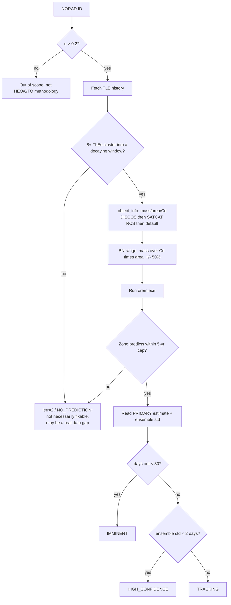

# OPERATIONS.md — New-Object Operational Workflow

Issue #15. How to take an arbitrary decaying HEO/GTO object — not one of
the curated validation cases — from "I have a NORAD ID" to a re-entry
prediction, and how to read what OREM hands back.

This document covers the *workflow*: where data comes from, how
per-object parameters are determined, and how to interpret a result.
For the mechanics of running `orem.exe` on a single config file by
hand, see `README.md` §5 (Quick Start) — this document doesn't repeat
that, it covers what comes before and after it.

Two paths exist, and which one applies depends on scale:

- **One-off manual run** — a single object, parameters set by hand.
  §1–§3 below.
- **Operational pipeline** — `hari251086/OREM-Watchlist`'s
  `heowatch` package, which automates every step below for an
  arbitrary candidate list on a recurring cadence. §4 documents what
  it actually does, since it's the real, running answer to most of
  this issue's original scope — not a proposal, a description of
  shipped code.

---

## 1. TLE acquisition

**Source**: Space-Track (`space-track.org`), via the `spacetrack`
Python client. `OREM-Watchlist/src/heowatch/spacetrack_client.py`
handles authentication (credentials from environment variables /
`~/.netrc`, never hardcoded — see `SPACE_TRACK_USAGE_POLICY.md` in
that repo for the exact rate-limit rules this project follows:
`gp_history` is rate-limited to "1 request per lifetime" per the
policy's own reading, so a fetch always requests only the epochs newer
than the last successful pull, never a range already on disk).

- **First-ever fetch for a NORAD ID**: full history backfill
  (`heowatch.fetch_object`).
- **Every fetch after that**: incremental, cursor-tracked in that
  object's `meta.json` — appends, never re-downloads.
- **Format OREM expects**: 2-line or 3-line element sets, one object
  per file, parsed by `TLEread.F` (the KSROP-lineage dependency). See
  any `input/example_*.tle.txt` for the exact format.

**Minimum TLE count**: there's no separate "minimum count" gate —
the real constraint is structural, inside `zone_select.F`:
`min_zone_pts` (shipped default **8**) TLEs must fall inside one
`max_zone_days`-wide window with `R² ≥ r2_thresh` (default 0.90) and a
negative slope (genuine decay, not noise) before *any* zone can form.
An object can have thousands of TLEs and still produce zero valid
zones if none of them ever cluster into a qualifying decaying window
(a real, documented failure mode — see `ALGORITHM.md` §9's "5 objects
with no clean decay signal at any window size tested"). There is
nothing to configure here beyond `min_zone_pts`/`max_zone_days`
themselves (§3).

**Sparse tracking cadence**: if an object's TLE cadence drops sharply
near the epoch you care about, the default `max_zone_days=20` may not
be wide enough to accumulate 8 points. `OREM-Watchlist` hit exactly
this for a real TIP-listed candidate (37398) and widened to
`max_zone_days=30` operationally for that reason — see §4.

---

## 2. Object characterization (mass, area, Cd)

OREM's own fitted quantity is BN (ballistic number, kg/m²) — mass and
area never enter the Fortran pipeline directly, only as the starting
*search range* for BN. Determining that range is real, solved
tooling, not manual lookup:

`heowatch.object_info.get_object_params` resolves mass/area/Cd for a
NORAD ID through a fallback chain, cached (DISCOS lookups are slow and
externally rate-limited, and don't need refreshing on a daily cadence):

1. **ESA DISCOS** (`discosweb.esoc.esa.int`) — mass and average
   cross-sectional area directly, when the object is catalogued there.
2. **Space-Track SATCAT RCS fallback** — if DISCOS has no entry,
   area is estimated from the SATCAT radar-cross-section value:
   `area ≈ RCS / (4π·reflectivity)`, an order-of-magnitude estimate
   for tumbling metallic debris (reflectivity default 0.3). Mass falls
   back to a configured default (500 kg) since RCS gives no mass
   information.
3. **Configured default** — if neither source has data:
   `default_mass_kg=500`, `default_area_m2=5.0`.

`Cd=2.2` (free-molecular-flow default for a tumbling object) is used
throughout regardless of source, per `config.yaml`'s `object_info`
block.

**This directly supersedes the TLE-decay-rate BN-estimation approach
originally proposed on this issue** (infer BN from observed mean-motion
decay rate) — a real, DISCOS/SATCAT-grounded mass/area estimate turned
out to be the shipped answer instead, and it's simpler: BN is computed
directly (`mass / (Cd × area)`), not inferred indirectly from orbital
dynamics before any propagation has even run.

---

## 3. Configuration

### BN search range

`heowatch.orem_wrapper.bn_range_from_params`: a ±50% band around the
`mass/(Cd·area)` point estimate from §2 (`bn_range_fraction=0.5` in
`config.yaml`). Falls back to a wide `[5, 200]` range only when
`object_info` itself had no real data anywhere (source=`"default"`) —
narrowing around a guess that's itself a guess isn't worth the false
precision.

**You don't need to get this exactly right.** Two mechanisms inside
OREM itself already correct a wrong starting range using the object's
own TLE data, per zone, automatically:
- **G2** (`estimate_bn_floor`) — extends `bn_lo` downward if a
  physics-based floor estimate from the object's own early trajectory
  falls below the caller's range.
- **G3** (`estimate_bn_bstar_prior`) — narrows each zone's range using
  that zone's own TLE-published BSTAR value via a literature-fit
  regression, intersection-only (never widens past what you passed
  in).

A rough starting range from §2 is a reasonable prior for the GA to
search from; it is not the final word on the object's ballistic
number.

### Zone selection / GA / force model

Write `orem.cfg` per `README.md` §5's format. The two knobs most
likely to need tuning per-object beyond the defaults:

- **`nzones_max`** (line 4) — OREM's own shipped validation default is
  **8**, tuned against a densely-tracked curated set (raising it
  doesn't help generically — tested and rejected for the broader
  population, issue #29). `OREM-Watchlist` runs its real, more
  variably-tracked candidates at **50** (the `mxz` array ceiling)
  instead, since always admitting whatever zones exist matters more
  for sparse real-world objects than it does for the curated set.
- **`max_zone_days`** (line 5, 2nd value) — shipped default **20**.
  Widen (30+) if the object's TLE cadence is sparse near the epoch of
  interest (§1).
- **`idrag_flag`** (line 8, 1st value) — **must be 1** for a real
  re-entry prediction; drag is what makes the orbit decay at all.
- Force model / SRP defaults (`ngeo_deg=20, nsun_deg=2, nmoon_deg=3`,
  SRP on) match the validated configuration — don't change these
  without re-validating against the campaign harnesses in
  `scratch_rpe/`.

`heowatch.orem_wrapper.write_orem_cfg` generates this file
programmatically from the above — use it as the reference
implementation for the exact line format if writing one by hand.

---

## 4. The operational pipeline (`OREM-Watchlist`)

For anything beyond a single hand-run object, this is the real,
running answer: `hari251086/OREM-Watchlist`'s `heowatch` package
chains every step above into one command.

```
classify.py       -- filter latest catalog pull to e > ecc_min (0.2),
                      split into decayed / about-to-decay (TIP-listed)
                      / not-yet-decayed
       |
fetch_object.py    -- incremental per-object TLE history (SS1)
       |
object_info.py     -- mass/area/Cd, DISCOS -> SATCAT RCS -> default (SS2)
       |
orem_wrapper.py     -- writes orem.cfg (SS3), runs orem.exe, parses
                        the report back into a typed result
       |
watchlist_db.py     -- records the run, upserts object status
```

Run via `python -m heowatch.run_predictions` (all classified
candidates) or `--norad <id>` for a specific object. See that repo's
own `README.md`/`ALGORITHM.md` for the full pipeline detail — this
section only maps its steps back onto this issue's original 5-item
scope, since it's a more complete answer than a static doc could stay
current with.

---

## 5. Interpretation

Every prediction report gives two estimates (README §5 Step 4):

- **PRIMARY (latest zone)** — the single most accurate estimator on
  the validated campaigns; use as the headline number.
- **Ensemble mean ± std** — agreement across all zones with a valid
  prediction. **Std is the zone-to-zone consistency signal this issue
  asked for**: tight agreement across independently-fitted zones means
  the fit is stable across different tracking windows, not just
  internally self-consistent within one window.

`OREM-Watchlist`'s `run_predictions.py` turns this into an explicit
status label (issue #20's alerting thresholds — reuse these rather
than inventing new ones):

| Status | Condition |
|---|---|
| `IMMINENT` | primary estimate < 30 days out |
| `HIGH_CONFIDENCE` | ensemble std < 2 days |
| `TRACKING` | has a primary estimate, neither of the above |
| `NO_PREDICTION` | no zone predicted a re-entry within the 5-year cap |

**What "trust" actually means here, empirically** (from the global RPE
investigation, issue #32): fit quality within a zone (`rms_fit`) does
**not** predict extrapolation accuracy — a tightly-fit zone can still
extrapolate badly (Phase 2 finding, r≈0 correlation). The one real,
validated confidence signal is **decay-phase proximity**: an object
whose last tracked TLE already sits at a low perigee (curated
predicting objects: mean 168 km) is far more likely to produce a
trustworthy prediction than one still at 300+ km (non-predicting
objects: mean 398 km) — objects that far from decay correctly decline
to predict imminent re-entry, that's not a bug. This ships as of v1.47:
every report prints the object's last-tracked-TLE perigee altitude
alongside these reference medians, explicitly labeled **not** a
calibrated confidence score (the two populations' distributions
overlap in the 150–340 km band) — a directional signal, not a
threshold to gate on mechanically.

---

## 6. Edge cases

- **Too few TLEs / no qualifying zone** → `ierr=2` (no zones found) or
  a `NO_PREDICTION` status downstream. Not necessarily fixable by
  widening `max_zone_days`/`nzones_max` — some objects genuinely have
  no clean decay signal in their tracked history at any window size
  (a real, characterized data-availability gap, not a tuning problem —
  `ALGORITHM.md` §9).
- **Very low eccentricity (not HEO)** → screened out upstream by
  `classify.py`'s `ecc_min=0.2` filter before an object ever reaches
  OREM. If running a single object by hand outside that pipeline and
  its eccentricity is near-circular, OREM itself has no dedicated
  guard against this — the zone-fitting methodology (eccentricity as a
  free GA parameter, apogee-decay-driven zone selection) is built for
  eccentric orbits and has not been validated on near-circular cases.
- **Maneuvering object** → `propagate_ks` has **zero thrust/maneuver
  modeling** (gravity + drag + SRP only) — this whole methodology's
  validity depends on that being the complete force model. There is
  **no automated maneuver-detection check** in the operational
  pipeline; a TLE-history maneuver-jump scanner was built during the
  RPE investigation (`scratch_rpe/diag_maneuver_scan.py`) and found no
  clean signature even for objects with documented active-disposal
  practice (Falcon 9 second stages) — a negative scan result is
  **not** a clean exoneration, a subtle burn can hide in ordinary
  tracking noise. The real precedent: three Falcon 9 objects were
  excluded from the validation roster on documented-operational-practice
  grounds alone (SpaceX's known post-separation deorbit burns), not
  because a scan flagged them. **Treat any actively-disposed platform
  class as out of scope by policy, not by detection.**
- **Deep-space / lunisolar resonance** → objects near-critical
  inclination (~63.4°) or in solar-apsidal resonance are a documented,
  understood limitation, not an error condition — issue #27's
  resolution found this is a real BN-identifiability problem for
  specific objects (e.g. 33587), not something a configuration change
  fixes. If a prediction looks wrong for a near-63° or very-low-
  inclination (<10°) object, check whether it matches this pattern
  before assuming a bug.

---

## 7. Decision flow



---

## 8. Cross-references

- `README.md` §5 — single-object manual run mechanics (compile,
  config format, output format).
- `ALGORITHM.md` §9 — known limitations in detail (BN-carryover
  fragility, generalization gap, gravity/density-model ceiling).
- `ARCHITECTURE.md` §7 — issue-by-issue development status.
- `hari251086/OREM-Watchlist` — the operational pipeline this document
  describes in §4; its own `README.md`/`ALGORITHM.md` are the
  authoritative, more-current source for that repo's own internals.
- `SPACE_TRACK_USAGE_POLICY.md` (in `OREM-Watchlist`) — Space-Track
  rate-limit rules referenced in §1.
